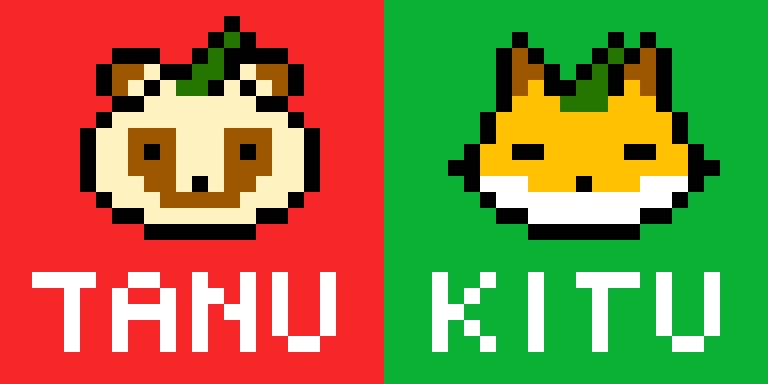
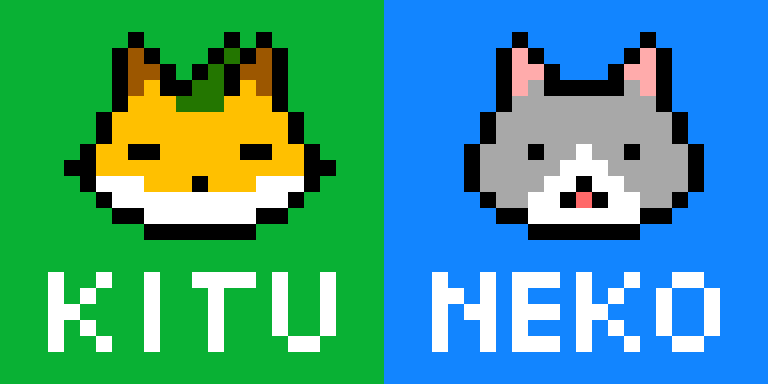

# たぬきつねこ


## 概要
- ペアプロやりたいので作り始めた課題
- [【はじプロ】ウナきりのゲーム作り ZUNKODICE編【VOICEROID実況】 - YouTube](https://www.youtube.com/watch?v=BPP40zka5Xw)を参考にして作ってみた

## 基本ルール
- 「た」「ぬ」「き」「つ」「ね」「こ」がそれぞれの面に書かれた6面サイコロがある。
- プレイヤーはこのダイスを6個投げ、役が成立するとポイントがもらえる。
- 役は次の通り。下に行くほど点数が高く、役の同時成立はないものとする（例：「ぬこねこきた」のときは、「たぬき」「ねこ」「ぬこ」は成立せず、「ぬこねこ」が成立する）。
  - ねこ：100
    - 
  - ぬこ：150
    - 
  - たぬき：200
    - 
  - きつね：200
    - 
  - たぬきつ：400
    - 
  - きつねこ：400
    - 
  - ぬこねこ：600
    - 
  - たぬきつねこ：1000
    - 

## 問題
### (1)「た」「ぬ」「き」「つ」「ね」「こ」の6面をもつサイコロを実装し、1つのサイコロを投げて出た目を出力してください

```ruby
# example（※クラス名、メソッド名は自由）
dice1 = Dice.new
dice1.roll # -> 「た」「ぬ」「き」「つ」「ね」「こ」のいずれかになる
```

### (2) 6個のサイコロを同時に投げ、出た目を結合して出力してください
- サイコロの目が『「た」「ぬ」「き」「つ」「ね」「こ」』であれば、`たぬきつねこ`を出力してください。

### (3) 6個のサイコロを同時に投げ、出た目と成立している役を出力してください
- サイコロの目が『「た」「ぬ」「き」「つ」「ね」「こ」』であれば、`（出た目）たぬきつねこ （成立した役）たぬきつねこ`を出力してください。
- 役は同時に成立しないことに注意してください。同時に複数の役が考えられる場合、もっとも得点が高い役を採用してください。

### (4) 6個のサイコロを同時に投げ、出た目と成立している役と点数を出力してください
- サイコロの目が『「た」「ぬ」「き」「つ」「ね」「こ」』であれば、`（出た目）たぬきつねこ （成立した役）たぬきつねこ（点数）1000`を出力してください。

### (5) (4)の出力時に、役に応じたドット絵を出力するようにしてください
- サイコロの目が『「た」「ぬ」「き」「つ」「ね」「こ」』であれば、`（出た目）たぬきつねこ （成立した役）たぬきつねこ（点数）1000`のあとに、以下の画像を出力してください。
- 

### (6) (5)までの内容を1ターンとし、5ターン連続で遊べるようにしてください

```bash
 % tanukituneko
 > （出た目）たぬきつねこ （成立した役）たぬきつねこ（点数）1000
 > 画像
 ... ×5回
```

### (7) (6)で5ターン遊び終わった後に、合計得点を表示してください

```bash
  % tanukituneko
  > （出た目）たぬきつねこ （成立した役）たぬきつねこ（点数）1000
  > 画像
  ... ×5回
  > 合計得点： 3200 点
```

### (8) NUDGE（イカサマ）機能を実装してください。
- NUDGE（突く）は一度サイコロが転がった後に、サイコロを再度振り直す機能です。
- NUDGEはゲームを通して5回まで使用することができます。1ターンに何度も使用することができます。
- プレイヤーはサイコロの目が出た時に、NUDGE回数が1回以上あれば、NUDGEをするかどうかを選択できます。
- NUDGEを使用しない場合は、即座に次のターンに移ります。

### (9) 役に応じて、NUDGE回数を付与するように役一覧を修正してください
- 修正後の役一覧は次の通りです。
  - ねこ：100, **NUDGE + 1**
  - ぬこ：150, **NUDGE + 3**
  - たぬき：200, **NUDGE + 1**
  - きつね：200, **NUDGE + 2**
  - たぬきつ：400, **NUDGE + 1**
  - きつねこ：400, **NUDGE + 2**
  - ぬこねこ：600, **NUDGE + 3**
  - たぬきつねこ：1000 
- 初期状態では5回までNUDGEができますが、出た役に応じて、追加でNUDGEできる回数が増えます。

### (10)  ノルマを5000点とし、5ターンではなく、5000点以上になったらゲームを終了して結果を表示するように修正してください

```bash
   % tanukituneko
   > （出た目）たぬきつねこ （成立した役）たぬきつねこ（点数）1000
   > 画像
   ... ×?回
   > 合計得点： 5100 点
```

### (11) ノルマ達成までにかかったターン数を、ゲーム終了時に表示してください

```bash
   % tanukituneko
   > （出た目）たぬきつねこ （成立した役）たぬきつねこ（点数）1000
   > 画像
   ... ×?回
   > 合計得点： 5100 点 かかったターン数：11
```

### (12) 役が完成した時に、ポイントを減らす「TAKO」を実装してください。

- TAKO：-200
-  
